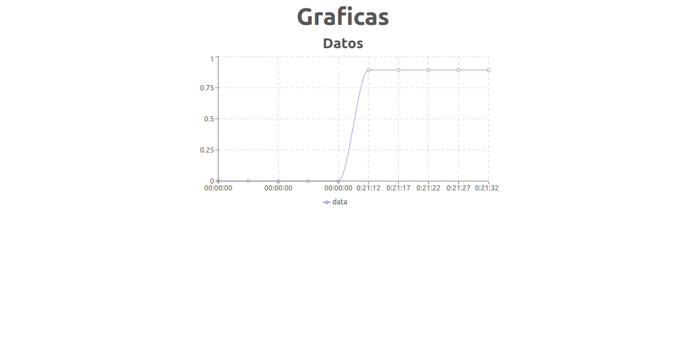

# Presentación Arquitectura de Computadores y Ensambladores 1

## Frontend

Se utilizó [ReactJs](https://es.reactjs.org/) para la construcción del frontend para simular la lectura de datos desde el Arduino Mega 2560 y mostrarlos en pantalla por medio de una gráfica.

Se utilizaron las librerías de apoyo de:

- [Recharts](https://recharts.org/en-US/): para la utilización de la gráfica.
- [React Suite](https://rsuitejs.com/): para el apoyo con la interfaz gráfica.
- [create-react-app](https://es.reactjs.org/docs/create-a-new-react-app.html): plantilla inicial de la aplicación.

## Backend

Se utilizó [Flask](https://flask.palletsprojects.com/en/1.1.x/) con el lenguaje de Python para la construcción del backend para la obtención de los datos para encender led y lectura de simulación de sensores que es el transistor.

| Ruta                     | Método | Descripción                                                  | Respuesta ejemplo                                 |
| ------------------------ | ------ | ------------------------------------------------------------ | ------------------------------------------------- |
| /                        | GET    | Obtención de una respuesta de control                        | "todo good"                                       |
| /getState                | GET    | Obtención del valor analogo, de encendido y respuesta OK     | {"analogo": 0.99, "encendido": false, "ok": true} |
| /setEncendido?val={bool} | GET    | Asignación de valor para encender o apagar el led del Arduino | {"ok": true, "newVal":true}                       |
| /setAnalogo?val={int}    | GET    | Asignación de un valor entero entre 0 y 1024 para obtener el porcentaje del sensor a utilizar (en este caso un transistor) | {"ok": true, "newVal":0.55}                       |

#### Documentos de apoyo

https://j2logo.com/leccion-1-la-primera-aplicacion-flask/

https://help.dreamhost.com/hc/es/articles/115000695551-Instalar-y-usar-virtualenv-con-Python-3

## Arduino

Se utilizaron los componentes:

- ESP-WROOM-32 (ESP-32)
- Arduino Mega 2560
- Transistor 100K Ohmios

#### Documentos de apoyo

https://randomnerdtutorials.com/esp32-http-get-post-arduino/

https://techtutorialsx.com/2018/05/17/esp32-arduino-sending-data-with-socket-client/

## Extras

* Para subir la aplicación en la nube se utilizó el servicio de EC2 de AWS.
* Se utilizó Docker y Docker Compose para contenerizar la aplicación y lograr subirlo fácilmente a la nube.

